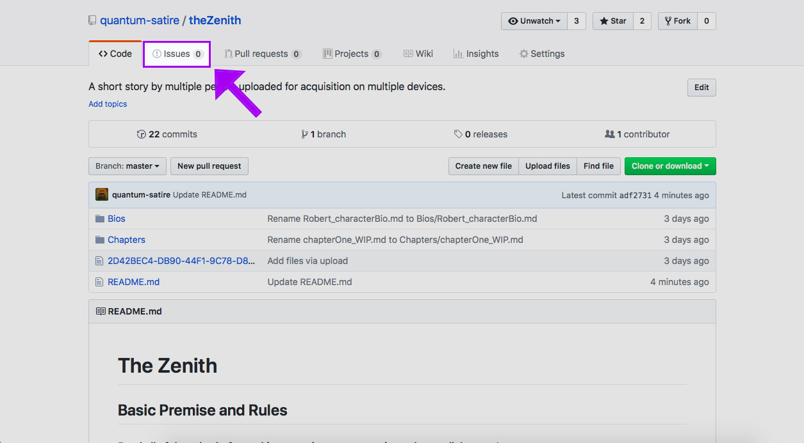
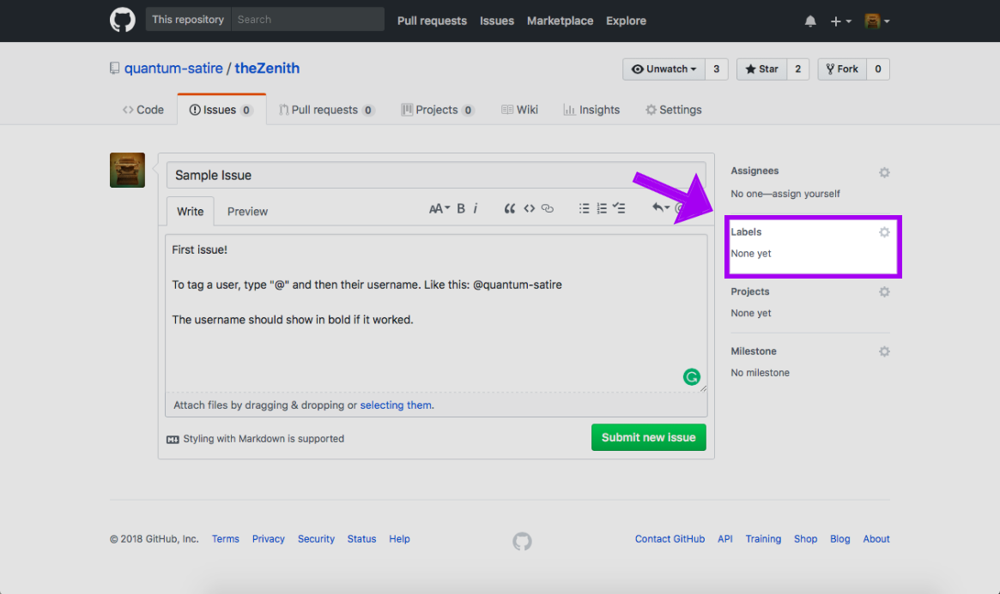
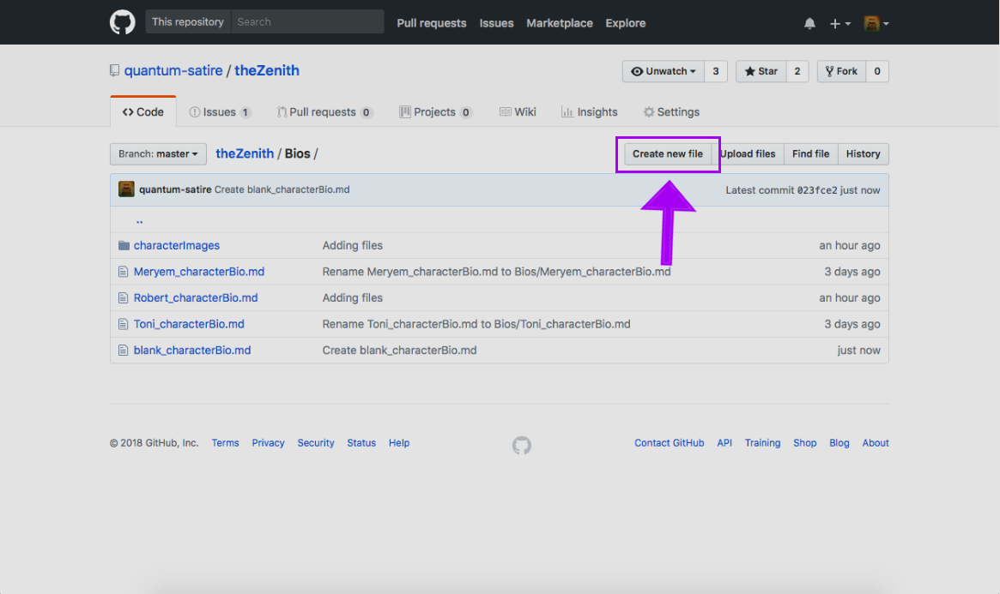

# The Zenith
## Premise and Rules
#### Read all of the rules before asking questions or requesting to be a collaborator!
Anyone is welcome to participate regardless of writing skill level, but please use proper grammar and spelling. Also, I will need to add you as a collaborator in order for you to participate, so please message me or start a new issue and tagging my username (@quantum-satire).
 
The Zenith is a collaborative story effort by several writers each taksed with creating one or more new characters and writing a chapter taking into account the already established setting, characters, lore, etc. Please have the courtesy to read the already written chapters in full before writing your own (otherwise, how will you know what's going on?) 

*It's okay to write a chapter using another person's character, but not featuring them.* The plot wouldn't go very well if none of the characters interacted, but this also requires each writer to understand that, once they have published a chapter, every other participating writer has the ability to incorporate that character in their own subsequent chapter(s) if they so wish.

*Please, no "god modding."* Don't kill off other characters unless you've spoken with the author of that character before hand (either in private or on the issues board). That's just rude.

*Keep the plot appropriate.* Listen, you're into your stuff and I'm into my stuff, but this just isn't the place to play out weird fantasies. If it's not in the lore and doesn't make a significant contribution to the plot, take a minute to think about if you really think other people would enjoy having to read / write more on that idea. Also, please no explicit sexual content!

### Basic Information about the Plot
- Setting: Late 1920s Prohibition-Era Boston, MA
- Genre: Fiction, Mystery / Suspense, Action (this may change as the plot wears on)
- Characters should be realistic in nature (human-only) though pets and other animals are allowed
_The Zenith is (a fictional) newspaper organization that is considered the most famous publication in the east coast. A zenith is also defined as "the time at which something is most powerful or successful"--take this into consideration when writing your chapters. This is the centralmost prompt.
Characters may choose to work for the paper, work as a rival to the paper, or work entirely separate from the paper. Jobs may consist of any conceivable career including (but not limited to) police work, criminal or undesirable activity (smugglers, dancers, robbers, etc.), scientists (medical examiners and morticians, chemists, mathematicians, etc.), journalists (photographers, writers, editors, etc.), curators (librarians, museum workers, etc.) and other such jobs that would fit into a Prohibition-Era time period. When choosing a job, please read up a little on the career choice appropriate for the period in order to assure historical accuracy._

## How to Use GitHub
As writers, you're probably not so familiar with a traditionally computer coder-friendly site like GitHub. All you need to know is that it's a great site for collaborative work and super easy once you get the hang of it. The two main things you will need to know is how to use the issues board and how to upload a file once you've written it.

First, to access the issues board, you will need to click the issues button, located in the top half of the home screen for the repository:

You'll need to start a new issue now. To do this, click on the green "New Issue" button at the top right corner. Write your question, give it a descriptive title, and add some labels to it! You do this by navigating to the "Labels" tab and selecting all of the relevent tags.

If you have any general questions about using GitHub, you can read their official guidelines and directions here: https://guides.github.com

GitHub supports Markdown. This is similar to Skype or Slack using asterisks and underscores to "flavor" text, or make it look pretty. Read about Markdown specifics on GitHub here: https://guides.github.com/features/mastering-markdown/

## Creating Character Bios
You're logged in, you've been accepted as a collaborator, now what? You should create a character bio to flex your creative skills and get some writing juices flowing. Creating a bio will allow you to show off your character and allow other writers the ability to get a feel for the character--remember that other writers will have the ability to write their characters into your character's life, and they'll need a personality and description to go by.

In order to create a character, copy the template [here](https://github.com/quantum-satire/theZenith/blob/master/Bios/blank_characterBio.md) by clicking the "Raw" button and selecting the text, then paste it into a new text file. Fill it out as much as you can. There's a placeholder image, all you need to do is replace that link with a link to the photo you want to show up as a faceclaim or reference image. Feel free to add more to the bio than what's already there, but at the minimum you should fill all of it out.

When you're finished filling out the bio, you'll need to create a new file to paste the information in. Click on the "Create New File" button inside of the proper folder:

Name the file with the naming convention of `charactername_characterBio.md`. **It is very important that you include `.md` at the end of your file name.** You'll do the same process when you add a chapter file.

## Discord Server
If you're accepted as a collaborator, you can join our Discord server and chat with us about mostly anything relating to the story. Join our Discord here: https://discord.gg/rRuREz2
